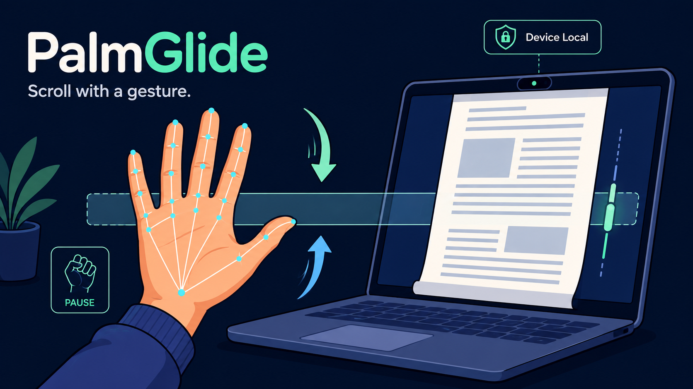

# PalmGlide



PalmGlide is a hands-free scrolling app for Windows and Linux. It watches for simple hand gestures through your webcam and sends normal mouse-wheel events to the window under your pointer.

> Built because reaching for the mouse while reading papers felt like too much cardio.

Everything runs locally. Camera frames are processed on your computer and are not uploaded.

## Gestures

- Hold an open palm briefly to activate scrolling.
- Move your palm above the neutral band to continue down the page.
- Move your palm below the neutral band to scroll up.
- Make a fist to pause.
- Press `q` in the camera window to quit.

## Download a build

Automated builds are produced for Windows and Linux by GitHub Actions. Open the latest successful **Build PalmGlide** workflow run and download the artifact for your platform.

### Windows

1. Download and unzip `PalmGlide-Windows`.
2. Run `PalmGlide.exe` from the extracted `PalmGlide` folder.
3. Allow camera access if Windows asks.
4. Put the pointer over the browser, PDF reader, or other window you want to scroll.

PalmGlide uses the native Windows `SendInput` API and does not need administrator access.

### Linux

1. Download and unzip `PalmGlide-Linux`.
2. From the source repository, run `sudo ./setup_uinput.sh` once.
3. Log out and back in so the new input-group membership takes effect.
4. Run the extracted `PalmGlide` executable.

PalmGlide emits wheel events through Linux `uinput`, which works on Wayland and X11.

## Run from source

### Linux

```bash
./install_local.sh
sudo ./setup_uinput.sh
```

Log out and back in after the input setup, then run:

```bash
source .venv/bin/activate
python palmglide.py
```

### Windows

In PowerShell, run these commands one line at a time:

```powershell
py -m venv .venv
.\.venv\Scripts\Activate.ps1
python -m pip install -r requirements.txt
New-Item -ItemType Directory -Force .\models
Invoke-WebRequest -Uri "https://storage.googleapis.com/mediapipe-models/hand_landmarker/hand_landmarker/float16/1/hand_landmarker.task" -OutFile ".\models\hand_landmarker.task"
python .\palmglide.py
```

## Options

```text
--camera 1       use a different camera
--no-preview     run without the camera window
--neutral 0.5    change the neutral palm height
--deadzone 0.16  change the no-scroll band
--max-rate 9     change the maximum scroll speed
--invert         reverse the scroll direction
```

Run `python palmglide.py --help` for the complete list.

## Build locally

Windows PowerShell:

```powershell
./scripts/build_windows.ps1
```

Linux:

```bash
./scripts/build_linux.sh
```

PyInstaller creates an unpacked application in `dist/PalmGlide`. Keep the folder contents together when moving the app.

## Current platform support

| Platform | Scrolling backend | Status |
| --- | --- | --- |
| Windows 10/11 | Native `SendInput` | Supported |
| Linux (Wayland/X11) | `uinput` | Supported; one-time permission setup required |
| macOS | — | Not yet supported |
